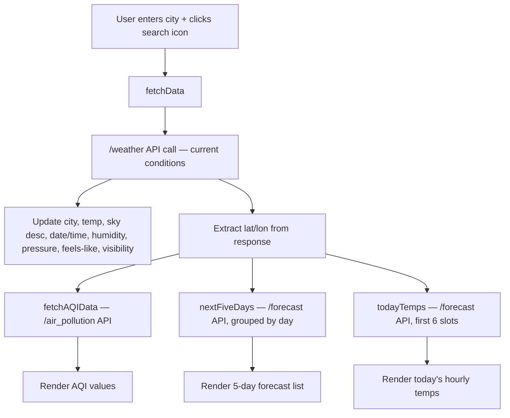

# 🌤️ Real-Time Weather Dashboard

A live weather dashboard that shows current conditions, hourly temperatures, a 5-day forecast, air quality index, and sunrise/sunset times for any city — powered by the OpenWeatherMap API.

---

## 📁 Project Structure

```
Real_Time_Weather_Dashboard/
│
├── index.html         ← App markup + all JavaScript logic (API calls, DOM updates)
├── index.css          ← Styling (glassmorphism cards, responsive layout)
│
└── icons & assets
    ├── search.png, calendar.png, time.png
    ├── flood.png, wind.png, wind (1).png, hot.png, eye.png
    ├── sun.png, sun (1).png, moon.png
    ├── cloud.png, clouds.png, cloudy.png, cloudy (1).png
    └── weather.png
```

> `index.css` references a background image (`2148933766.jpg`) that isn't in the current file list — make sure that file is included in the repo, or the page background will be missing.

---

## ⚙️ Prerequisites

- A modern web browser (no build step or server required)
- A free [OpenWeatherMap](https://openweathermap.org/api) API key

---

## 🚀 Setup & Run

```bash
# Clone the repository
git clone https://github.com/Avinash-2752/Real_Time_Weather_Dashboard.git
cd Real_Time_Weather_Dashboard

# Just open it in a browser
# (double-click index.html, or use a local server e.g.:)
npx live-server
```

No installation or build tools needed — it's a static HTML/CSS/JS page that calls the OpenWeatherMap API directly from the browser.

---

## 📖 Usage

1. Type a city name into the search bar and click the search icon (no Enter-key handler is wired up currently).
2. The dashboard fetches and displays:
   - Current temperature, sky description, date & time
   - Humidity, pressure, "feels like" temperature, visibility
   - Air Quality Index breakdown (CO, SO2, O3, NO2)
   - Sunrise & sunset times
   - Today's hourly temperatures (next 6 forecast slots)
   - Next 5 days' forecast (date, day name, temperature)

---

## 🧠 How It Works



---

## 📦 Tech Stack

| Layer | Technology |
|-------|------------|
| Markup / Styling | HTML5, CSS3 (glassmorphism via `backdrop-filter`), Bootstrap 5 |
| Scripting | Vanilla JavaScript (`async`/`await`, `fetch`), jQuery |
| Fonts | Google Fonts — Comfortaa |
| Data Source | OpenWeatherMap API — Current Weather, 5-Day Forecast, Air Pollution endpoints |

**Note:** This is a plain client-side app (HTML/CSS/JS) — there's no React, build tooling, or backend involved.

---

## ⚠️ Known Issues / Notes

- The OpenWeatherMap API key is hardcoded directly in `index.html` — for a public repo, consider regenerating the key and loading it from an environment variable or a config file excluded via `.gitignore`.
- The 5-day forecast icon and today's-temp icon are hardcoded to `cloud.png` / `cloudy.png` rather than mapped dynamically from the API's `icon` code — so the icon shown may not match the actual condition.
- No error message is shown to the user if a city name doesn't match any results (only the AQI/forecast calls have a try/catch with an alert).

---

## 📄 License

MIT — free to use, modify and distribute.
